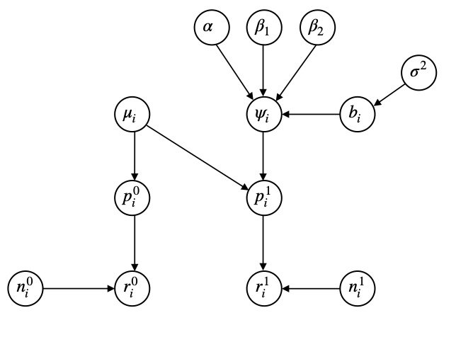

\newenvironment{cols}[1][]{}{}
\newenvironment{col}[1]{\begin{minipage}{#1}\ignorespaces}{%
\end{minipage}
\ifhmode\unskip\fi
\aftergroup\useignorespacesandallpars}
\def\useignorespacesandallpars#1\ignorespaces\fi{%
#1\fi\ignorespacesandallpars}
\makeatletter
\def\ignorespacesandallpars{%
  \@ifnextchar\par
    {\expandafter\ignorespacesandallpars\@gobble}%
    {}%
}
\makeatother

\renewcommand\contentsname{Table des matières}
\newpage
\tableofcontents
\newpage

```{r setup, include=FALSE, cache=TRUE}
knitr::opts_chunk$set(echo = FALSE)
knitr::opts_chunk$set(comment = "")
knitr::opts_chunk$set(fig.align = "center")

library(coda)

# Data
K = 120
r1 = c(3, 5, 2, 7, 7, 2, 5, 3, 5, 11, 6, 6, 11, 4, 4, 2, 8, 8, 6, 5, 15, 4, 9, 9, 4, 12, 8, 8, 6, 
       8, 12, 4, 7, 16, 12, 9, 4, 7, 8, 11, 5, 12, 8, 17, 9, 3, 2, 7, 6, 5, 11, 14, 13, 8, 6, 4, 
       8, 4, 8, 7, 15, 15, 9, 9, 5, 6, 3, 9, 12, 14, 16, 17, 8, 8, 9, 5, 9, 11, 6, 14, 21, 16, 6, 
       9, 8, 9, 8, 4, 11, 11, 6, 9, 4, 4, 9, 9, 10, 14, 6, 3, 4, 6, 10, 4, 3, 3, 10, 4, 10, 5, 4, 
       3, 13, 1, 7, 5, 7, 6, 3, 7)
n1 = c(28, 21, 32, 35, 35, 38, 30, 43, 49, 53, 31, 35, 46, 53, 61, 40, 29, 44, 52, 55, 61, 31, 
       48, 44, 42, 53, 56, 71, 43, 43, 43, 40, 44, 70, 75, 71, 37, 31, 42, 46, 47, 55, 63, 91, 
       43, 39, 35, 32, 53, 49, 75, 64, 69, 64, 49, 29, 40, 27, 48, 43, 61, 77, 55, 60, 46, 28, 
       33, 32, 46, 57, 56, 78, 58, 52, 31, 28, 46, 42, 45, 63, 71, 69, 43, 50, 31, 34, 54, 46, 
       58, 62, 52, 41, 34, 52, 63, 59, 88, 62, 47, 53, 57, 74, 68, 61, 45, 45, 62, 73, 53, 39, 
       45, 51, 55, 41, 53, 51, 42, 46, 54, 32)
r0 = c(0, 2, 2, 1, 2, 0, 1, 1, 1, 2, 4, 4, 2, 1, 7, 4, 3, 5, 3, 2, 4, 1, 4, 5, 2, 7, 5, 8, 2, 
       3, 5, 4, 1, 6, 5, 11, 5, 2, 5, 8, 5, 6, 6, 10, 7, 5, 5, 2, 8, 1, 13, 9, 11, 9, 4, 4, 8, 
       6, 8, 6, 8, 14, 6, 5, 5, 2, 4, 2, 9, 5, 6, 7, 5, 10, 3, 2, 1, 7, 9, 13, 9, 11, 4, 8, 2, 
       3, 7, 4, 7, 5, 6, 6, 5, 6, 9, 7, 7, 7, 4, 2, 3, 4, 10, 3, 4, 2, 10, 5, 4, 5, 4, 6, 5, 3, 
       2, 2, 4, 6, 4, 1)
n0 = c(28, 21, 32, 35, 35, 38, 30, 43, 49, 53, 31, 35, 46, 53, 61, 40, 29, 44, 52, 55, 61, 31, 
       48, 44, 42, 53, 56, 71, 43, 43, 43, 40, 44, 70, 75, 71, 37, 31, 42, 46, 47, 55, 63, 91, 
       43, 39, 35, 32, 53, 49, 75, 64, 69, 64, 49, 29, 40, 27, 48, 43, 61, 77, 55, 60, 46, 28, 
       33, 32, 46, 57, 56, 78, 58, 52, 31, 28, 46, 42, 45, 63, 71, 69, 43, 50, 31, 34, 54, 46, 
       58, 62, 52, 41, 34, 52, 63, 59, 88, 62, 47, 53, 57, 74, 68, 61, 45, 45, 62, 73, 53, 39, 
       45, 51, 55, 41, 53, 51, 42, 46, 54, 32)
year = c(-10, -9, -9, -8, -8, -8, -7, -7, -7, -7, -6, -6, -6, -6, -6, -5, -5, -5, -5, -5, -5, 
         -4, -4, -4, -4, -4, -4, -4, -3, -3, -3, -3, -3, -3, -3, -3, -2, -2, -2, -2, -2, -2, 
         -2, -2, -2, -1, -1, -1, -1, -1, -1, -1, -1, -1, -1, 0, 0, 0, 0, 0, 0, 0, 0, 0, 0, 1, 1, 
         1, 1, 1, 1, 1, 1, 1, 1, 2, 2, 2, 2, 2, 2, 2, 2, 2, 3, 3, 3, 3, 3, 3, 3, 3, 4, 4, 4, 4, 
         4, 4, 4, 5, 5, 5, 5, 5, 5, 6, 6, 6, 6, 6, 7, 7, 7, 7, 8, 8, 8, 9, 9, 10)

y = data.frame(r1, n1, r0, n0, year)

sigmoid = function(x){
  return(y = 1/(1+exp(-x))) 
}

p0 = function(mu){
  return(sigmoid(mu))
}

p1 = function(mu, alpha, beta1, beta2, b, year){
  return(sigmoid(mu + alpha + beta1*year + beta2*(year**2-22) + b))
}

lvr0 = function(mu){
  r = 0
  # Calcul de la log-vraisemblance de r0
  for (i in 1:length(mu)){
    r = r + r0[i] * log(p0(mu[i])) + (n0[i] - r0[i]) * log(1 - p0(mu[i]))
  }
  return(r)
}

lvr1 = function(mu, alpha, beta1, beta2, b, year){
  r = 0
  # Calcul de la log-vraisemblance de r1
  for (i in 1:length(mu)){
    r = r + r1[i] * log(p1(mu[i], alpha, beta1, beta2, b[i], year[i])) +
      (n1[i] - r1[i]) * log(1 - p1(mu[i], alpha, beta1, beta2, b[i], year[i]))
  }
  return(r)
}

Gibbs = function(nchain, data, priors){
  
  ni = nrow(data)
  
  # État initial proposé par les auteurs
  alpha = 0
  beta1 = 0
  beta2 = 0
  sigma = 1
  mu = c(0,0,0,0,0,0,0,0,0,0,0,0,0,0,0,0,0,0,0,0,0,0,0,0,0,0,0,0,0,0,0,0,0,0,0,0,0,0,0,0,0,0,0,
         0,0,0,0,0,0,0,0,0,0,0,0,0,0,0,0,0,0,0,0,0,0,0,0,0,0,0,0,0,0,0,0,0,0,0,0,0,0,0,0,0,0,0,
         0,0,0,0,0,0,0,0,0,0,0,0,0,0,0,0,0,0,0,0,0,0,0,0,0,0,0,0,0,0,0,0,0,0)
  b = c(0,0,0,0,0,0,0,0,0,0,0,0,0,0,0,0,0,0,0,0,0,0,0,0,0,0,0,0,0,0,0,0,0,0,0,0,0,0,0,0,0,0,0,
        0,0,0,0,0,0,0,0,0,0,0,0,0,0,0,0,0,0,0,0,0,0,0,0,0,0,0,0,0,0,0,0,0,0,0,0,0,0,0,0,0,0,0,
        0,0,0,0,0,0,0,0,0,0,0,0,0,0,0,0,0,0,0,0,0,0,0,0,0,0,0,0,0,0,0,0,0,0)
  
  init = c(alpha, beta1, beta2, sigma, mu, b)
  
  # Début de la chaîne
  chain = matrix(NA, nchain + 1, 244)
  chain[1,] = init
  for (k in 1:nchain){
    # Mise à jour de alpha
    prop = rnorm(1, alpha, sqrt(priors[1]))
    
    top = - prop**2 / (2 * 1000**2) + lvr1(mu, prop, beta1, beta2, b, data[,5])
    bottom = - alpha**2 / (2 * 1000**2) + lvr1(mu, alpha, beta1, beta2, b, data[,5])
      
    acc_prob = exp(top - bottom)
    
    if (runif(1) < acc_prob){
      alpha = prop
    }
    
    # Mise à jour de beta1
    prop = rnorm(1, beta1, sqrt(priors[2]))
      
    top = - prop**2 / (2 * 1000**2) + lvr1(mu, alpha, prop, beta2, b, data[,5])
    bottom = - beta1**2 / (2 * 1000**2) + lvr1(mu, alpha, beta1, beta2, b, data[,5])
      
    acc_prob = exp(top - bottom)
    
    if (runif(1) < acc_prob){
      beta1 = prop
    }
    
    # Mise à jour de beta2
    prop = rnorm(1, beta2, sqrt(priors[3]))
      
    top = - prop**2 / (2 * 1000**2) + lvr1(mu, alpha, beta1, prop, b, data[,5])
    bottom = - beta2**2 / (2 * 1000**2) + lvr1(mu, alpha, beta1, beta2, b, data[,5])
      
    acc_prob = exp(top - bottom)
    
    if (runif(1) < acc_prob){
      beta2 = prop
    }
    
    # Mise à jour de sigma
    a.sigma = priors[4] + ni/2
    b.sigma = (2 * priors[5] + sum(b**2))/2
    
    sigma = 1/sqrt(rgamma(1, a.sigma, 1/b.sigma))
    
    # Mise à jour de mu
    for (i in 1:length(mu)){
      prop = rnorm(1, mu[i], sqrt(priors[6]))
        
      top = - prop**2 / (2 * 1000**2) + 
        r0[i] * log(p0(prop)) + (n0[i] - r0[i]) * log(1 - p0(prop)) + 
        r1[i] * log(p1(prop, alpha, beta1, beta2, b[i], data[,5][i])) +
        (n1[i] - r1[i]) * log(1 - p1(prop, alpha, beta1, beta2, b[i], data[,5][i]))
      bottom = - mu[i]**2 / (2 * 1000**2) + 
        r0[i] * log(p0(mu[i])) + (n0[i] - r0[i]) * log(1 - p0(mu[i])) + 
        r1[i] * log(p1(mu[i], alpha, beta1, beta2, b[i], data[,5][i])) +
        (n1[i] - r1[i]) * log(1 - p1(mu[i], alpha, beta1, beta2, b[i], data[,5][i]))
        
      acc_prob = exp(top - bottom)
      
      if (runif(1) < acc_prob){
        mu[i] = prop
      }
    }
    
    # Mise à jour de b
    for (i in 1:length(b)){
      prop = rnorm(1, b[i], sqrt(priors[7]))
        
      top = - prop**2 / (2 * sigma**2) + 
        r1[i] * log(p1(mu[i], alpha, beta1, beta2, prop, data[,5][i])) +
        (n1[i] - r1[i]) * log(1 - p1(mu[i], alpha, beta1, beta2, prop, data[,5][i]))
      bottom = - b[i]**2 / (2 * sigma**2) + 
        r1[i] * log(p1(mu[i], alpha, beta1, beta2, b[i], data[,5][i])) +
        (n1[i] - r1[i]) * log(1 - p1(mu[i], alpha, beta1, beta2, b[i], data[,5][i]))
        
      acc_prob = exp(top - bottom)
      
      if (runif(1) < acc_prob){
        b[i] = prop
      }
    }
    
    # Mise à jour de la chaîne
    chain[k+1,] = c(alpha, beta1, beta2, sigma, mu, b)
    
  }
  
  return(chain)
}

chain = Gibbs(10**4, y, c(0.1, 0.1, 0.1, 0.001, 0.001, 1, 1))

library(coda)
burnin = 1:1000
# plot(mcmc(chain[-burnin,])[,1:4])

s = summary(mcmc(chain[-burnin,]))$statistics[1:4,]
```

# Présentation du jeu de données

L'objectif de cette étude est d'observer l'influence que peut avoir l'exposition d'une mère aux rayons X pendant sa grossesse sur les décés des enfants par un cancer (de 0 à 9 ans). Les données sont séparées en 120 jeux de données en fonction de l'âge de l'enfant de son année de naissance (1944-1964). Dans notre cas, seule l'influence de l'année de naissance est retenue. Ces valeurs varient de $-10$ à $10$ en prenant en compte que $0$ correspond à l'année 1954. Pour chacune des 120 partitions, on dispose du nombre de décés $r$ parmi une population de $n$ enfants pour deux groupes : 

* un groupe d'enfants dont les mères ont été exposées à des rayons X au cours de leur grossesse
* un groupe "témoin" dont les mères n'ont pas été exposées.

# Présentation du modèle

Regardons maintenant le modèle proposé par les auteurs. Pour chaque strate $i$ et pour les deux groupes de population, le nombre de décés est donné par une loi binomiale : 

* $r_i^0 \sim Bin(n_i^0,p_i^0)$
* $r_i^1 \sim Bin(n_i^1,p_i^1)$.

Ainsi les paramètres $p_i^0$ et $p_i^1$ sont donnés par les deux formules suivantes : 

* $p_i^0 = sigmoid(\mu_i)$
* $p_i^1 = sigmoid(\mu_i+\alpha+\beta_1 year_i+\beta_2(year_i^2-22)+b_i)$ ou bien $p_i^1 = sigmoid(\mu_i+log\psi_i)$ où $log\psi_i = \alpha+\beta_1 year_i+\beta_2(year_i^2-22)+b_i$.

Le paramètre $b_i$ suit une loi normale $\mathcal N(0,\sigma^2)$.

Il reste donc les lois "non informatives" des paramètres suivants : 

* $\alpha \sim\mathcal N(0,\sigma_{\alpha}^2)$
* $\beta_1 \sim\mathcal N(0,\sigma_{\beta_1}^2)$
* $\beta_2 \sim\mathcal N(0,\sigma_{\beta_2}^2)$
* $\sigma^2 \sim InvGamma(a_{\sigma},b_{\sigma})$
* $\mu_i \sim\mathcal N(0,\sigma_{\mu}^2)$.

On représente le modèle hiérarchique sous la forme d'un graphe ci-dessous.

{width=50%}

# Calculs des lois conditionnelles pleines

On veut maintenant calculer les lois conditionnelles pleines de nos paramètres afin de mettre en oeuvre un échantilloneur de Gibbs sur ce modèle. Bien que la loi conditionnelle pleine de $\sigma^2$ soit identifiable, celles des autres paramètres ne sont pas identifiables. On donne ici un exemple de calcul pour le paramètre $\alpha$, les autres calcul sont donnés en annexe. Les noeuds de notre modèle représentés par $log(\psi_i)$, $p_i^0$ et $p_i^1$ étant non stochastiques dans notre modèle, on peut les ignorer lors du calcul des lois conditionnelles pleines.

## Calcul pour $\sigma^2$

On calcule la loi conditionnelle pleine du paramètre $\sigma^2$.

\begin{align*}
\Pi(\sigma^2|...) &\propto \Pi(\sigma^2) \prod_{i=1}^n\Pi(b_i|\sigma^2) \\
&\propto \exp\left({\frac{-b_{\sigma}}{\sigma^2}}\right)(\sigma^2)^{-a_{\sigma}-1}\prod_{i=1}^{n} \exp\left(\frac{-b_i^2}{2\sigma^2}\right)(\sigma^2)^{-\frac{1}{2}} \\
&\propto (\sigma^2)^{-a_{\sigma}-1-\frac{n}{2}} \exp\left(\frac{-2b_{\sigma}-\sum\limits_{i=1}^n b_i^2}{2\sigma^2}\right)
\end{align*}

Ainsi, on identifie une loi inverse gamma :

\begin{align*}
\Pi(\sigma^2|...) &\sim InvGamma(\frac{n}{2}+a_{\sigma},\frac{2b_{\sigma}+\sum\limits_{i=1}^n b_i^2}{2})
\end{align*}

## Exemple de calcul pour une loi non identifiable

On calcule la loi conditionnelle pleine du paramètre $\alpha$.

\begin{align*}
\Pi(\alpha|...) &\propto \Pi(\alpha) \prod_{i=1}^n\Pi(r_i^1|...) \\
&\propto \exp\left({\frac{-\alpha^2}{2\sigma_{\alpha}^2}}\right)\prod_{i=1}^n \left((p_i^1)^{r_i^1}(1-p_i^1)^{n_i^1-r_i^1}\right)
\end{align*}

où $p_i^0=sigmoid(\mu_i)$ et $p_i^1=sigmoid(\mu_i+\alpha+\beta_1 year_i+\beta_2(year_i^2-22)+b_i)$.

# Implémentation et résultats


# Annexe

## Loi conditionnelle pleine du paramètre $\beta_1$

\begin{align*}
\Pi(\beta_1|...) &\propto \Pi(\beta_1) \prod_{i=1}^n\Pi(r_i^1|...) \\
&\propto \exp\left({\frac{-\beta_1^2}{2\sigma_{\beta_1}^2}}\right)\prod_{i=1}^n \left((p_i^1)^{r_i^1}(1-p_i^1)^{n_i^1-r_i^1}\right)
\end{align*}

## Loi conditionnelle pleine du paramètre $\beta_2$

\begin{align*}
\Pi(\beta_2|...) &\propto \Pi(\beta_2) \prod_{i=1}^n\Pi(r_i^1|...) \\
&\propto \exp\left({\frac{-\beta_2^2}{2\sigma_{\beta_2}^2}}\right)\prod_{i=1}^n \left((p_i^1)^{r_i^1}(1-p_i^1)^{n_i^1-r_i^1}\right)
\end{align*}

## Loi conditionnelle pleine du paramètre $b_i$

\begin{align*}
\Pi(b_i|...) &\propto \Pi(b_i|\sigma^2) \Pi(r_i^1|...) \\
&\propto \exp\left({\frac{-b_i^2}{2\sigma^2}}\right) \left((p_i^1)^{r_i^1}(1-p_i^1)^{n_i^1-r_i^1}\right)
\end{align*}

## Loi conditionnelle pleine du paramètre $\mu_i$

\begin{align*}
\Pi(\mu_i|...) &\propto \Pi(\mu_i)\Pi(r_i^0|\mu_i)\Pi(r_i^1|...) \\
&\propto \exp\left({\frac{-\mu_i^2}{2\sigma_{\mu}^2}}\right)\left((p_i^0)^{r_i^0}(1-p_i^0)^{n_i^0-r_i^0}\right)\left((p_i^1)^{r_i^1}(1-p_i^1)^{n_i^1-r_i^1}\right)
\end{align*}
